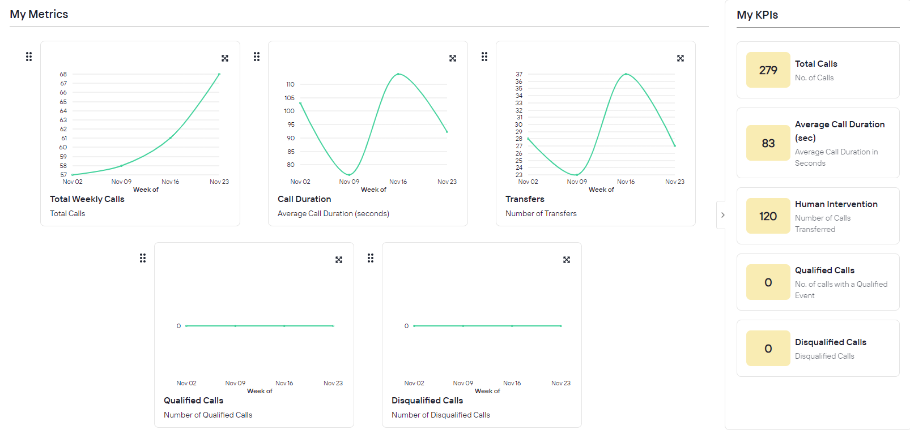

# Dashboard

The Dashboard provides real-time visibility into your AI agent's performance through key metrics and KPIs. This section helps you monitor call handling efficiency and identify areas for optimization.

## My Metrics

The metrics panel displays interactive graphs tracking three essential performance indicators over time:

1. **Total Weekly Calls**: Total number of calls fielded by the agent per week
2. **Call Duration**: Displays average conversation length in seconds, including full interaction time (AI conversation + transfer wait time)
3. **Transfers**: Shows number of calls escalated to human agents

## My KPIs

The KPIs panel provides cumulative performance metrics since deployment:

1. **Total Calls**: Aggregate number of calls handled
2. **Average Call Duration (sec)**: Mean conversation length across all calls
3. **Human Intervention**: Total number of calls transferred to live agents
