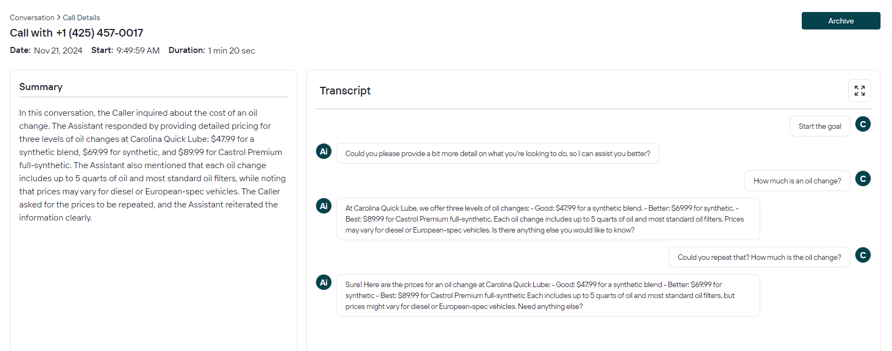

# Conversations

The Conversations section provides comprehensive visibility into all customer interactions across multiple communication channels. This centralized view helps you monitor customer engagement, analyze conversation patterns, and ensure quality service delivery.

## Calls

Track and analyze voice interactions through our call log interface. Key information such as call direction (inbound/outbound), start time, duration, and transfer status are available at a glance. 

Clicking on any number in the log provides additional information, such as a detailed call transcript and AI-generated conversation summary.

## SMS

SMS enables text-based interactions with your AI agents, providing users flexibility in their preferred communication channel.

## Emails

*TODO*

## Web Chats

*TODO*