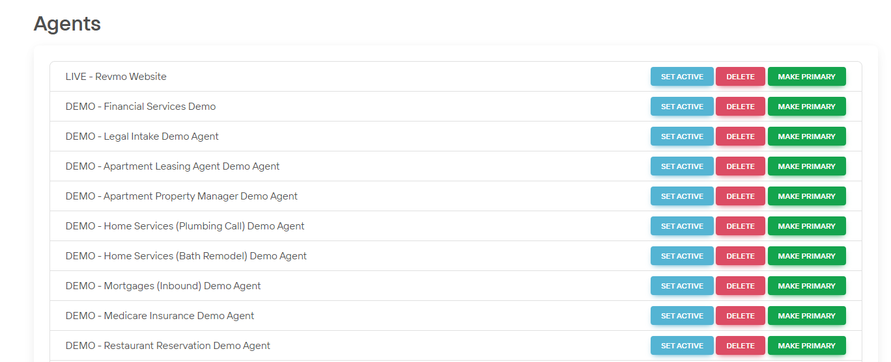

# Agents

The Agents panel enables management of multiple AI agents across your organization. Each agent can be configured for specific locations, use cases, or testing environments.

## Managing Agents

### Key Actions
- **Set Active**: Switch current working agent
- **Make Primary**: Set default agent for login  
- **Delete**: Permanently remove agent (*irreversible*)
- **Rename**: Click agent name to edit

### Active vs. Primary Agent
- **Active Agent**: Currently selected for platform operations
- **Primary Agent**: Default agent shown at login

## Best Practices
- Create separate agents for different locations/use cases
- Test configuration changes on development agents
- Use clear naming conventions for easy identification
