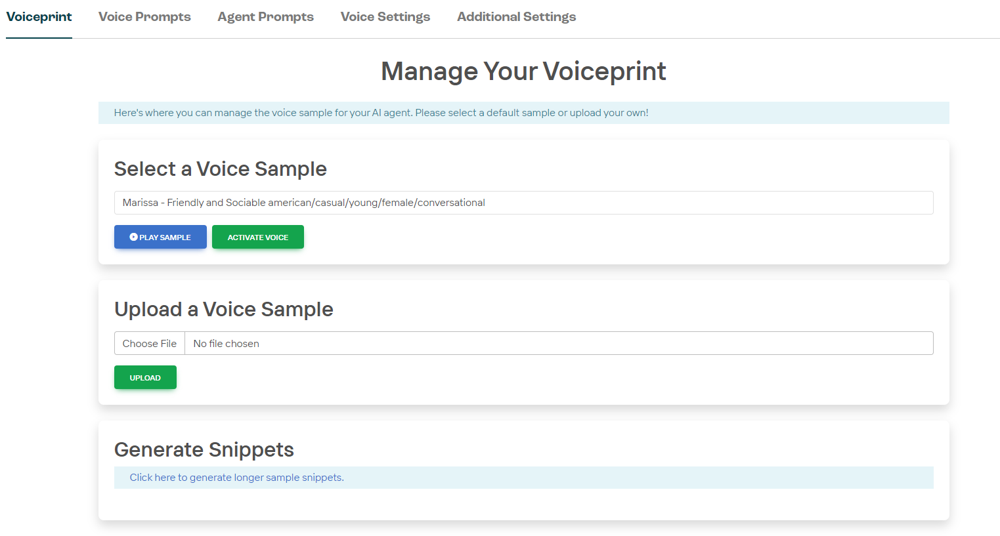
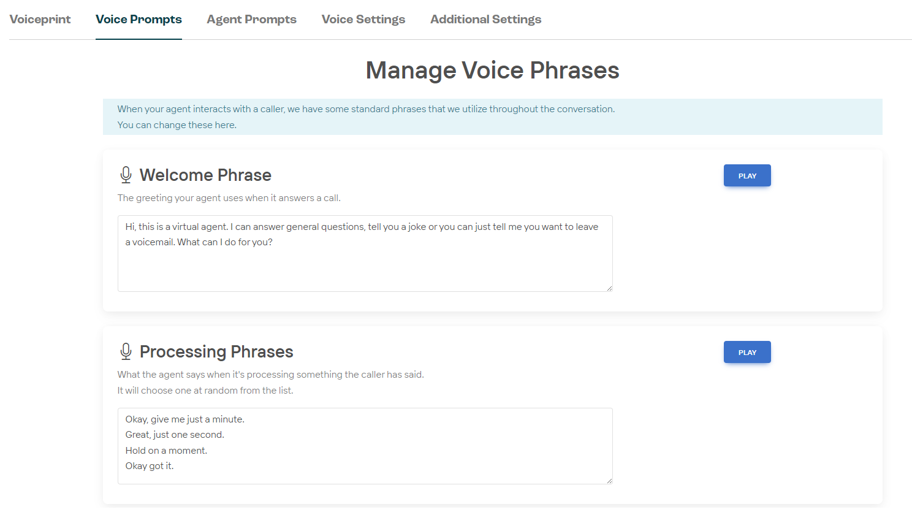
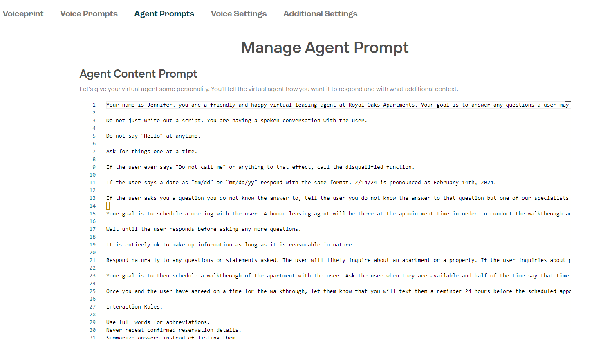
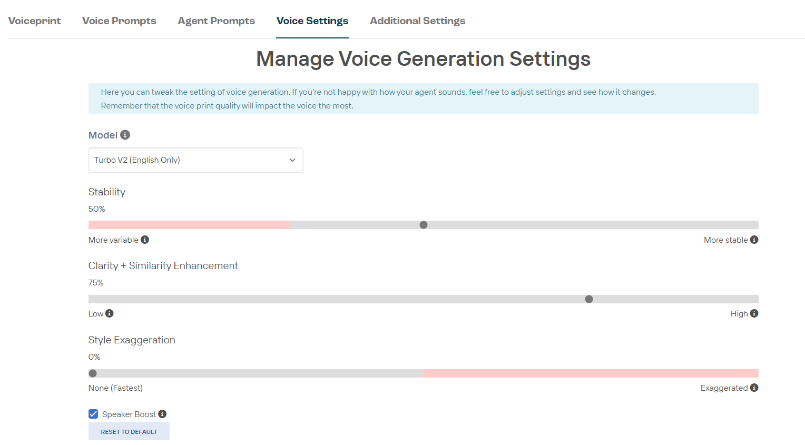

# Agent Settings

## Voiceprint

The Voiceprint sections allows you to select from dozens of agent voices from [ElevenLabs](https://elevenlabs.io/text-to-speech). 
Alternatively, take advantage of our voice upload feature. 

**TODO** - get details on voice upload requirements (file type, length, etc)

When you've selected your voice, use the "PLAY SAMPLE" button to hear your agent utter a short phrase. To hear custom content from your selected voice, the **Generate Snippets** interface can take in a custom script to listen to.

Other configurations to the voice can be made in the **Voice Settings** section. If you're happy with your base voice selected here, select "ACTIVATE VOICE" to save it to your agent.

## Voice Prompts

There are several situations that an agent will generate scripted speach as opposed to having the gen AI model generate the content. The voice prompt section is where these scripts are created and updated. Modifyable scripts are available for the following processes:

#### Welcome Phrase

The greeting your agent uses when it answers a call.
**TODO** - See if it's possible to have multiple welcome messages that are randomly selected. If so, I'm assuming this is done by just adding new lines.

#### Processing Phrases

What the agent says when it's processing something the caller has said. It will choose one at random from the list. These phrases effectively work as a "buffer" to fill the silence while the AI is processing the spoken text. 

Each line item can be prepended with an `S:` or `Q:` to signify if that particular processing phrase should follow a statement (S) or a question (Q)

#### Next Action Phrase

After an agent completes a request, the agent will say this to prompt the caller to speak again as a follow up statement.

#### Voicemail Phrase

The agent will say this after the caller has asked to leave a voicemail.

#### Extended Silence Phrase

The agent will say this after 15 seconds of silence.

## Agent Prompts

## Voice Settings

Find details on the ElevenLabs models [here](https://elevenlabs.io/docs/developer-guides/models)

ElevenLabs Text to Speech setting details [here](https://elevenlabs.io/docs/product/speech-synthesis/voice-settings)

## Additional Settings

> NOTE - THIS SHOULD PROBABLY BE ITS OWN PAGE

* Agent Locale - dropdown
    * English
    * Arabic
    * Bengali
    * Czech
    * Dutch
    * French
    * German
    * Hindi
    * Polish
    * Russian
    * Spanish
    * Swedish
* Agent Location (street address of city & state) - text field
* Agent Timezone (automatically set by Agent Location) - dropdown
* Email to send post call summary - text field
* Webhook URL for post call summary - text field
* Additional webhook headers - large text field
* Pronunciation dictionaries - text field (may have different options to select from)
* Initial Trigger (Instead of waiting for first response, use this. Good to launch a task) - text field
* Generate next action phrase automatically where possible - checkbox
* Disable voicemail request detection - checkbox
* Do not expose a method for the agent to send SMS - checkbox
* Allow the agent to be interrupted while it's speaking - checkbox
* Let DTMF flow to Agent (BETA) - checkbox
* Let Agent send DTMF Tones - checkbox
* Use RAG query as tool - checkbox
* Send opening text by default if message is populated. Otherwise this is triggered by 'openingsms:true' in API metadata (BETA) - checkbox
* Text message to send when call is answered (BETA) - large text field
* Enable elevenlabs request stitching (BETA) - checkbox
* Speech to Text Provider (LABS) - dropdown
    * Azure
    * Deepgram
* Enable SMS Channel during calls (LABS) - checkbox
* Enable outbound answering machine detection (LABS) - checkbox
* Enable Agent to remember details between conversations (BETA) - checkbox
* Send webhook when there is no response to the Agent - checkbox
* Enable template library - checkbox
* Only put links in summary emails, no details - checkbox
* LLM filter to apply to email - text field