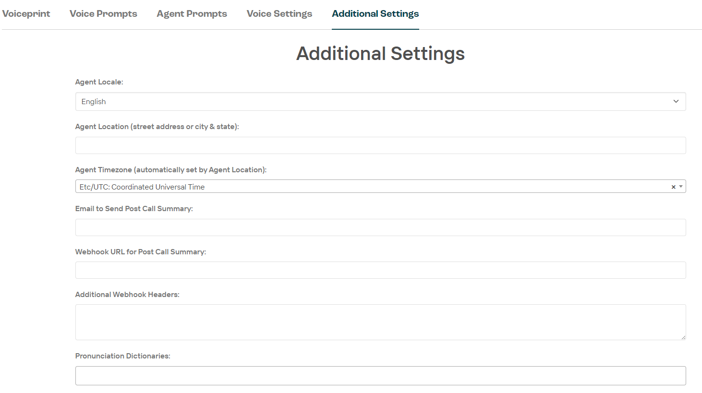

# Agent Settings

## Voiceprint

## Voice Prompts

## Agent Prompts

## Voice Settings

Find details on the ElevenLabs models [here](https://elevenlabs.io/docs/developer-guides/models)

ElevenLabs Text to Speech setting details [here](https://elevenlabs.io/docs/product/speech-synthesis/voice-settings)

## Additional Settings

> NOTE - THIS SHOULD PROBABLY BE ITS OWN PAGE

* Agent Locale - dropdown
    * English
    * Arabic
    * Bengali
    * Czech
    * Dutch
    * French
    * German
    * Hindi
    * Polish
    * Russian
    * Spanish
    * Swedish
* Agent Location (street address of city & state) - text field
* Agent Timezone (automatically set by Agent Location) - dropdown
* Email to send post call summary - text field
* Webhook URL for post call summary - text field
* Additional webhook headers - large text field
* Pronunciation dictionaries - text field (may have different options to select from)
* Initial Trigger (Instead of waiting for first response, use this. Good to launch a task) - text field
* Generate next action phrase automatically where possible - checkbox
* Disable voicemail request detection - checkbox
* Do not expose a method for the agent to send SMS - checkbox
* Allow the agent to be interrupted while it's speaking - checkbox
* Let DTMF flow to Agent (BETA) - checkbox
* Let Agent send DTMF Tones - checkbox
* Use RAG query as tool - checkbox
* Send opening text by default if message is populated. Otherwise this is triggered by 'openingsms:true' in API metadata (BETA) - checkbox
* Text message to send when call is answered (BETA) - large text field
* Enable elevenlabs request stitching (BETA) - checkbox
* Speech to Text Provider (LABS) - dropdown
    * Azure
    * Deepgram
* Enable SMS Channel during calls (LABS) - checkbox
* Enable outbound answering machine detection (LABS) - checkbox
* Enable Agent to remember details between conversations (BETA) - checkbox
* Send webhook when there is no response to the Agent - checkbox
* Enable template library - checkbox
* Only put links in summary emails, no details - checkbox
* LLM filter to apply to email - text field